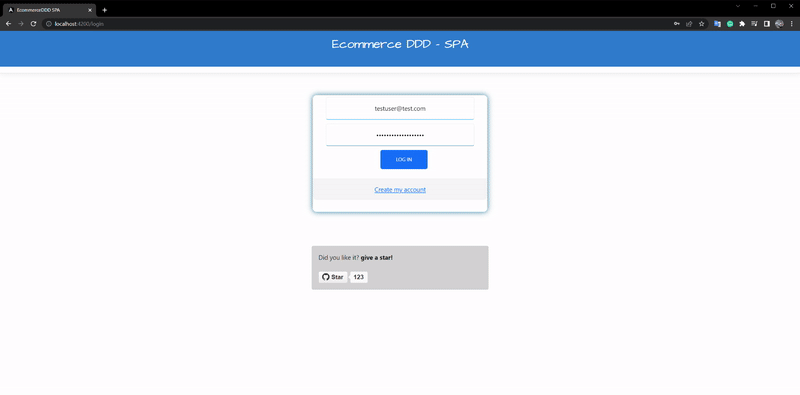
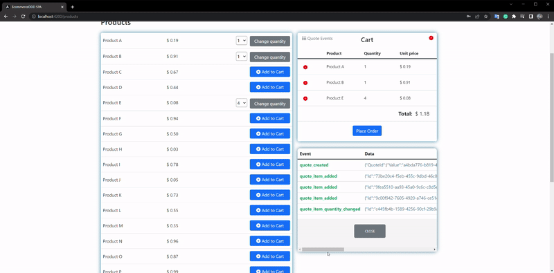
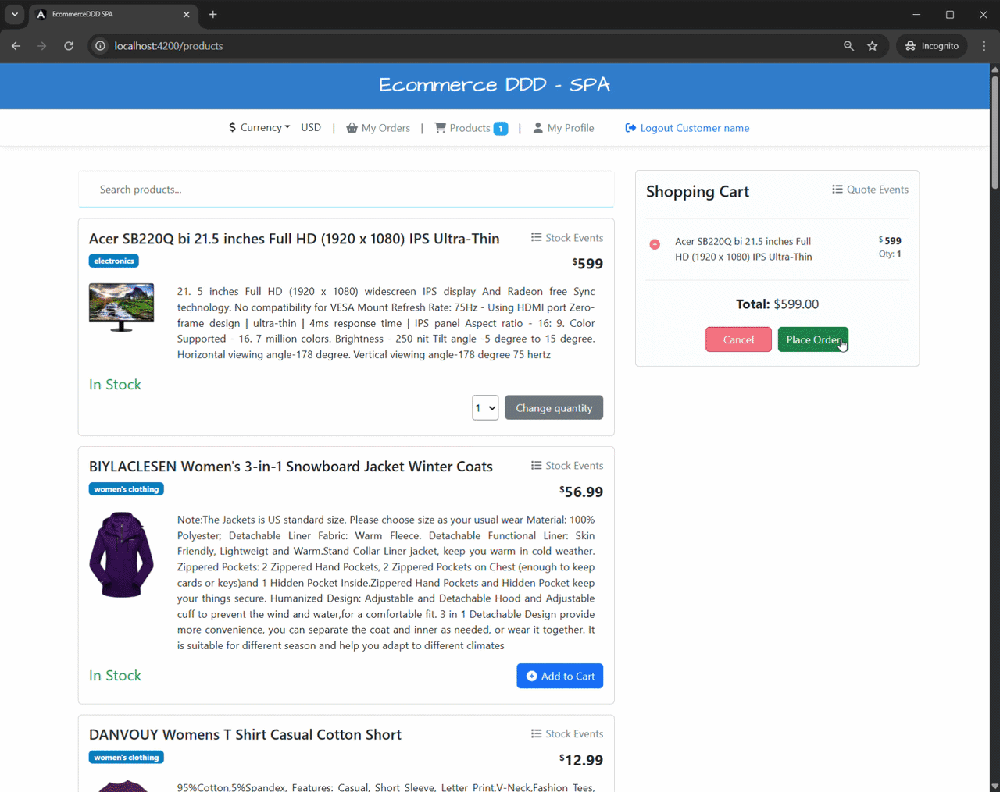

[](LICENSE)

## Welcome to Ecommerce DDD
This project is an experimental full-stack application I use to combine several cutting-edge technologies and architectural patterns. Thanks for getting here! please <b>give a ⭐</b> if you liked the project. It motivates me to keep improving it.
<br><br>

<a href="images/ecommerceddd-1.gif" target="_blank">

</a>

<a href="images/ecommerceddd-2.gif" target="_blank">

</a>

<a href="images/ecommerceddd-3.gif" target="_blank">

</a>

<br/><br/>


## Architecture
The overall architecture is organized with `Core`, `Crosscutting` and `Services`.

### Core
It defines all the building blocks and abstractions to be used on every underlying project.

### Core.Infrastructure
It implements infrastructure matters to be used by microservices. Also, it centralizes third-party packages.

### Crosscutting
It contains projects with logic needed to cross over the microservices, such as `IdentityServer4` and `API gateway`.

<br/>

### Services
The microservices composing the back-end, are built to be as simple as possible, structured with `Domain`, `Application`, `API`, `Infrastructure`.

#### - Domain

This is where the business logic resides, with a structured implementation of the domain through aggregates, commands, value objects, domain services, repository definitions, and domain events.

#### - Application

It orchestrates the interactions between the external world and the domain to perform application tasks through use cases by handling commands and queries. 

#### - Infrastructure

It acts as a supporting library for higher layers. It handles infrastructural matters and data persistence.

<br/>

### Presentation
A lightweight Angular-based `SPA` providing a functional and user-friendly UI.

<br/>

## Technologies used
<ul>
  <li>
    <a href='https://get.asp.net' target="_blank">ASP.NET</a> and <a href='https://msdn.microsoft.com/en-us/library/67ef8sbd.aspx' target="_blank">C# 10</a>
    for cross-platform back-end with:
    <ul>
      <li>.NET 7</li>
        <li>ASP.NET Core Minimal API</li>
        <li>Ocelot 19.0.2</li>
        <li>Marten 6.0.0-rc.1</li>
        <li>Entity Framework Core 7.0.5</li>
        <li>Postgres for Entity Framework Core 7.0.4</li>
        <li>ASP.NET Core Identity 7.0.5</li>
        <li>ASP.NET Core Authentication JwtBearer 7.0.5</li>
        <li>Duende IdentityServer 6.2.3</li>
        <li>MediatR 12.0.1</li>
        <li>Fluent Assertions 6.11.10</li>
        <li>XUnit 2.4.2</li>
        <li>Moq 4.18.4</li>
        <li>Swagger 6.5.0</li>
        <li>Confluent Kafka 2.1.0</li>
        <li>Docker Compose</li>
    </ul>
  </li>
  <li>
    <a href='https://angular.io/' target="_blank">Angular 15</a> and <a href='http://www.typescriptlang.org/' target="_blank">TypeScript</a> for the front-end with:
    <ul>
      <li>NgBootstrap / Bootstrap 5.2.3</li>
      <li>Font Awesome</li>
      <li>Toastr</li>
    </ul>
  </li>
</ul>

<br/><br/>


## What do you need to run it 

### Running the microservices using Docker

The project was designed to be easily run within docker containers, hence all you need is 1 command line to up everything. Make sure you have `Docker` installed and have fun!


- Download Docker: <a href="https://docs.docker.com/docker-for-windows/wsl/" target="_blank">Docker Desktop with support for WLS 2</a>
    
<br/>

Using a terminal, run:

```console
 $ docker-compose up
``` 

You can also set the `docker-compose.dcproj` as a Startup project on Visual Studio if you want to run it while debugging. 

<br/>

### Running the Angular SPA
    
Using a terminal, navigate to `EcommerceDDD.Spa` and run for the following commands the node packages and serving the SPA on `http://localhost:4200` respectively:

```console
 $ npm install #first time only
 $ ng serve
```
