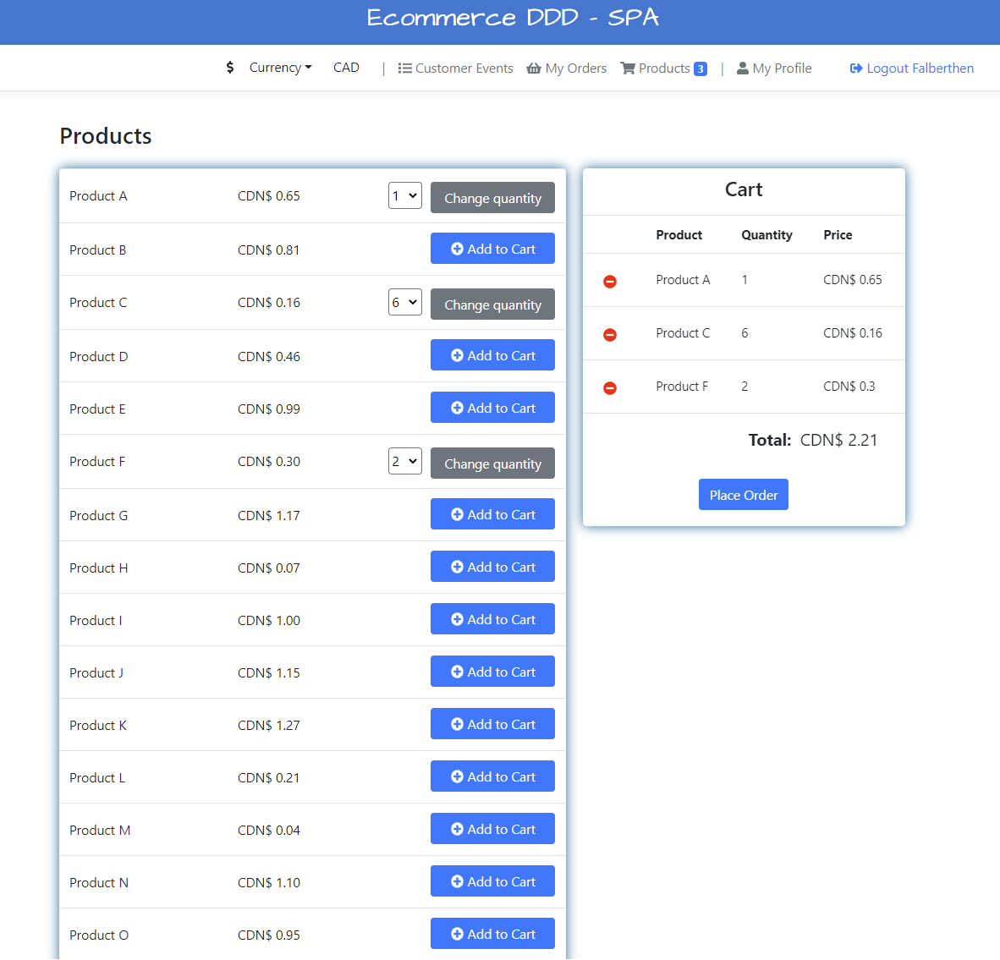
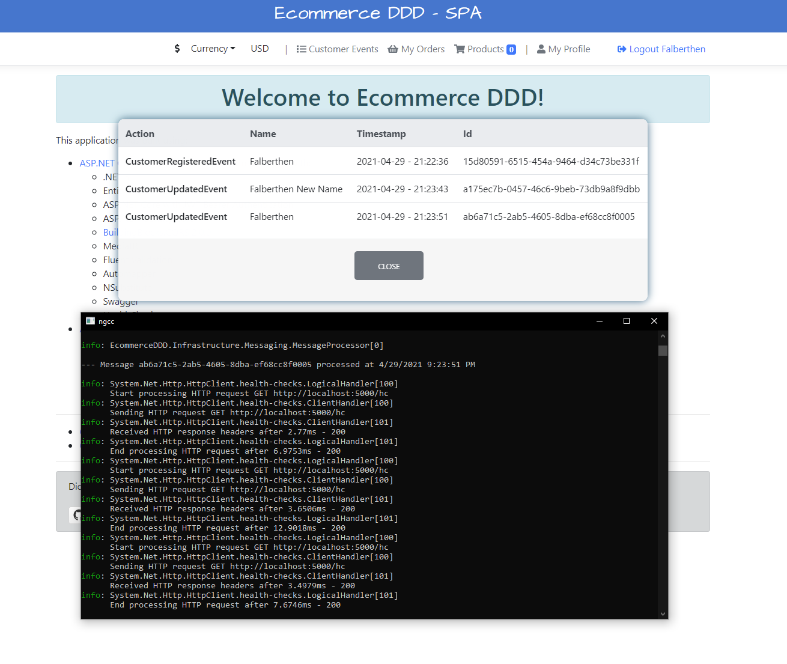
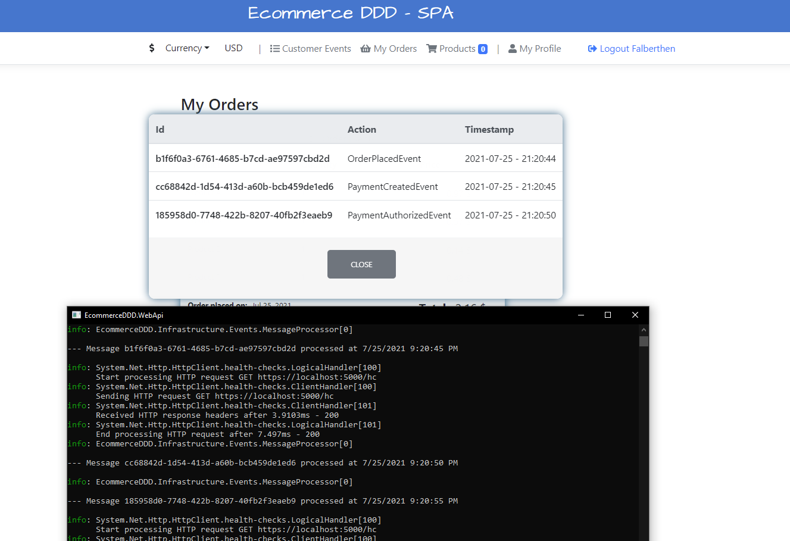

## Welcome to Ecommerce DDD

This project is a showcase of a full-stack application I use to combine several cutting-edge technologies and architectural patterns.  
It is based on Domain-Driven Design at its core for implementing a clean-architectured API that powers up an Angular-based SPA application, 
and also demonstrates the powerful combination of the CQRS pattern with Event Sourcing.

 Thanks for getting here! please <b>let your star</b> if you liked the project. It motivates me to keep improving it.

### Screenshots 

 

 

 

 

You will find a quick summary of the architecture below:

### Domain
It is where the business logic lies, with a structured implementation of the models and its invariants that make up the e-commerce through <b>concrete</b> Aggregates, Entities, Value objects, Domain Services, Repository definitions and, Domain Events.
  

### Domain SeedWork
This project defines the classes used as a base for all domain building blocks, such as Entities, Value objects, Aggregate root, Repositories, Services and more. 
  

### Application
It orchestrates the interactions between the external world (API/SPA) and the domain. It is concerned with defining the jobs needed to be done to accomplish a certain application task. Since the project is based on CQRS/EventSourcing architecture, it defines and handles Commands, Queries and Events.
  

### Infrastructure
It takes care of the application's infrastructure and issues not related to the business itself. It is responsible for Database (ORM) creation, Domain Repository implementation, Identity authentication and User Claims, JWT Authentication, tooling for processing and publishing messages, Inversion of Control and, everything else needed to support the upper layers.
  

### Presentation
- <b>Web API</b>: A restful API providing endpoints with secured routes based on user claims. 
  It also implements and host a <b>BackgroundService</b> for processing and publishing stored events.
- <b>SPA</b>: A lightweight Angular-based application using modular components to provide a functional and user-friendly UI.

### Technologies used:
<ul>
  <li>
    <a href='https://get.asp.net' target="_blank">ASP.NET Core</a> and <a href='https://msdn.microsoft.com/en-us/library/67ef8sbd.aspx' target="_blank">C#</a>
    for cross-platform back-end with:
    <ul>
      <li>.NET 5</li>
      <li>Entity Framework Core 5.0.5</li>
      <li>ASP.NET Core Web API</li>
      <li>ASP.NET Core Identity</li>
      <li>SignalR Core</li>
      <li>JWT Bearer Authentication</li>
      <li><a href='https://github.com/falberthen/BuildingBlocks.CQRS' target="_blank">BuildingBlocks.CQRS 2.x</a></li>
      <li>MediatR</li> 
      <li>Fluent Validation</li>
      <li>Automapper</li>
      <li>NSubstitute</li>
      <li>Swagger</li>
      <li>HealthChecks</li>
      <li>Docker Compose</li>
    </ul>
  </li>
  <li>
    <a href='https://angular.io/' target="_blank">Angular 12</a> and <a href='http://www.typescriptlang.org/' target="_blank">TypeScript</a> for the front-end with:
    <ul>
      <li>NgBootstrap</li>
      <li>Font Awesome</li>
      <li>Toastr</li>
      <li>Angular JWT</li>
    </ul>
  </li>
</ul>

### What do you need to run it:

<ul>
  <li>The latest <a href="https://dotnet.microsoft.com/download" target="_blank">.NET Core SDK</a> and <a href="https://www.microsoft.com/en-us/sql-server/sql-server-downloads" target="_blank">SQL Server</a> for the database. Entity Framework can be used with other technologies, but some configuration may be needed.</li>
  <li><a href='https://nodejs.org' target="_blank">NodeJs</a> for the front-end.</li>
  <li><b>Optional: <a href="https://docs.docker.com/docker-for-windows/wsl/" target="_blank">Docker Desktop with support for WLS 2</a>
</ul>

### Running the WebAPI
<ul>
  <li>Self-Hosted: set <b>EcommerceDDD.Api</b> as the <b>Startup project</b> and run</li>  
  <li>Docker: run <code>docker-compose up --build </code></li>
</ul>

### Running the Angular SPA
<ul>
  <li>Using a terminal, navigate to <b>/EcommerceDDD.Spa</b>, run <code>npm install</code> for the node packages if first run. 
   Use <code>ng serve</code> for building and serving the SPA on <b>http://localhost:4200
  </b></li>
</ul>

<strong>Notes:</strong> 
<ul>
  <li>
    The <b>docker-compose.yml</b> is targeting the OS to <b>Linux</b> and setting up the with <b>SQL Server 2019 for Ubuntu</b> 
  </li>
  <li>
    When registering your first customer, it will create the database structure automatically.
     <b>DataSeeder will add some products for you if the Products table is empty.
  </li>
</ul>