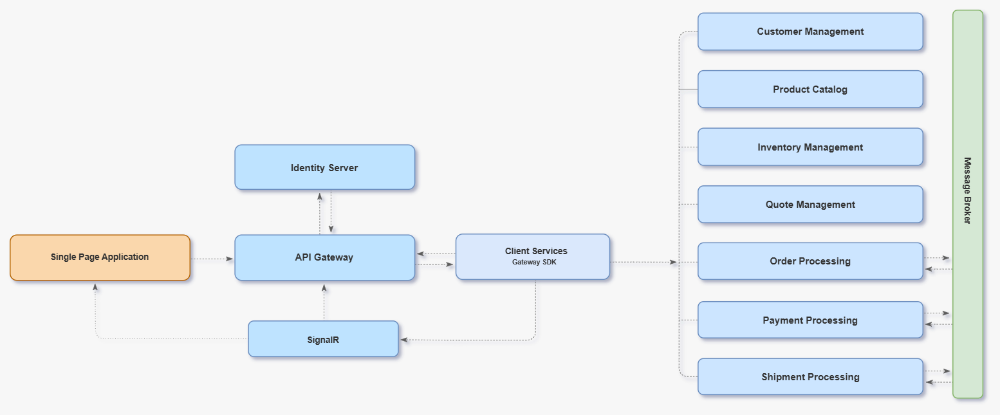

# 🛒 EcommerceDDD

An experimental full-stack application showcasing cutting-edge technologies and architectural patterns for building scalable e-commerce systems.

   


[](https://opensource.org/licenses/MIT)

⭐ **If you find this project useful, please consider giving it a star!** It helps others discover the project. 

<br/>

<p align="center">
  
</p>

<p align="center">
  
</p>

<p align="center">
  
</p>

---

## 🏗️ Architecture

### High-Level Overview

<p align="center">
  
</p>

### Detailed Architecture

<p align="center">
  
</p>

---

## 📁 Project Structure

```
├── Core                    # Building blocks and abstractions
├── Core.Infrastructure     # Shared infrastructure implementations
│
├── Crosscutting
│   ├── ServiceClients      # Kiota-generated HTTP clients
│   ├── ApiGateway          # Ocelot API Gateway
│   ├── SignalR             # Real-time communication
│   └── IdentityServer      # Authentication & authorization
│
├── Services
│   ├── CustomerManagement
│   ├── InventoryManagement
│   ├── OrderProcessing
│   ├── PaymentProcessing
│   ├── ProductCatalog
│   ├── QuoteManagement
│   └── ShipmentProcessing
│
├── SPA                     # Angular frontend
└── docker-compose          # Container orchestration
```


| Layer | |
|-------|-------------|
| **Core** | Defines building blocks and abstractions used across all projects. Highly abstract with no implementations. |
| **Core.Infrastructure** | Shared infrastructure abstractions and implementations for all microservices. |
| **Crosscutting** | Projects that cross-cut all microservices: `IdentityServer`, `API Gateway`, and `ServiceClients` with Kiota-generated HTTP clients. |
| **Services** | Backend microservices built with a vertically sliced structure. |
| **SPA** | Lightweight Angular-based Single Page Application. |

<br/>

### Microservice Structure

Each microservice follows a clean vertical slice architecture.

```
├── EcommerceDDD.ProductCatalog
│   ├── API              # RESTful endpoints
│   ├── Application      # Use cases, commands & queries
│   ├── Domain           # Aggregates, entities, domain events
│   └── Infrastructure   # Data persistence & external integrations
```

---

## 🔗 Service Communication

#### External Communication (SPA → Backend)

- [Koalesce.OpenAPI](https://github.com/falberthen/Koalesce) aggregates all OpenAPI definitions exposed in the **API Gateway**.
- **Kiota** generates typed TypeScript clients from this unified spec.
- The Angular SPA communicates through the **API Gateway** using the clients.

#### Internal Communication (Service-to-Service)

Microservices communicate directly using **Kiota-generated typed HTTP clients**.

---

## 🛠️ Tech Stack

### Backend

| Technology | Version |
|------------|---------|
| .NET | 10 |
| C# | 12 |
| Koalesce | 1.0.0-beta.8 |
| Ocelot | 24.1.0 |
| Marten | 8.22.0 |
| Confluent Kafka | 2.13.0 |
| Entity Framework Core | 10.0.3 |
| Npgsql (PostgreSQL) | 10.0.0 |
| Duende IdentityServer | 7.4.6 |
| Polly | 8.6.5 |
| Microsoft Kiota | 1.21.2 |
| OpenTelemetry | 1.15.0 |
| xUnit | 2.9.3 |
| NSubstitute | 5.3.0 |

### Frontend

| Technology | Version |
|------------|---------|
| angular | 21.1.3 |
| typescript | 5.9.3 |
| jest | 30.2.0 |
| @ng-bootstrap/ng-bootstrap | 20.0.0 |
| bootstrap | 5.3.5 |
| @fortawesome/angular-fontawesome | 4.0.0 |
| ngx-toastr | 19.0.0 |

---

## 🔌 Getting Started

### Running with Docker

**Backend only** — starts all microservices, databases, Kafka, and infrastructure:

```bash
docker compose up
```

**Backend + Frontend** — also builds and serves the Angular SPA at `http://localhost:4200`:

```bash
docker compose --profile frontend up
```

> 💡 **Tip:** You can also set `docker-compose.dcproj` as the startup project in Visual Studio for debugging.

<br/>

### Running the SPA locally (with hot-reload)

If you prefer running the frontend outside Docker for development, start the backend with `docker compose up`, then:

```bash
cd src/EcommerceDDD.Spa
npm install
ng serve
```

The app will be available at `http://localhost:4200`.

<br/>

### Advanced: Regenerating Kiota Clients

If you want to regenerate all typed HTTP clients, after containers are running:

```bash
docker-compose --profile tools run regenerate-clients
```

This generates:
- **Backend clients (C#):** `ServiceClients/Kiota/`
- **Single Frontend client (TypeScript):** `EcommerceDDD.Spa/src/app/clients/`

---

## 📄 License

This project is licensed under the terms of the [LICENSE](LICENSE) file.

---

<p align="center">
  Made with ❤️ by <a href="https://github.com/falberthen">Felipe Henrique</a>
</p>
