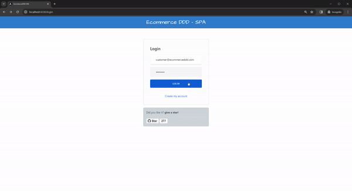

[](LICENSE)

## Welcome to Ecommerce DDD
This project is an experimental full-stack application I use to combine several cutting-edge technologies and architectural patterns. Thanks for getting here! please <b>give a ⭐</b> if you liked the project. It motivates me to keep improving it.
<br><br>

<a href="images/ecommerceddd-1.gif" target="_blank">

</a>

<a href="images/ecommerceddd-2.gif" target="_blank">

</a>

<a href="images/ecommerceddd-3.gif" target="_blank">

</a>

<br/><br/>


## Architecture
<a href="images/diagram.jpg" target="_blank">

</a>

```
├── Core
├── Core.Infrastructure
│
├── Crosscutting
│   ├── ApiGateway
│   └── IdentityServer
│
├── Services
│   ├── CustomerManagement
│   ├── InventoryManagement
│   ├── OrderProcessing
│   ├── PaymentProcessing
│   ├── ProductCatalog
|   |   └─ EcommerceDDD.ProductCatalog
│   │      ├── API
│   │      ├── Application
│   │      ├── Domain
│   │      └── Infrastructure
│   ├── QuoteManagement
│   └── ShipmentProcessing
│
├── SPA
└── docker-compose
```

- **Core** <br/>
It defines the building blocks and abstractions used on all underlying projects. Its nature is very abstract, with no implementations.

- **Core.Infrastructure** <br/>
It holds some abstractions and implementation for infrastructure to be used by all microservices and underlying dependencies.

- **Crosscutting** <br/>
It contains project implementations that cross-cut all microservices, such as `IdentityServer` and `API gateway`.

- **Services** <br/>
The microservices composing the backend are built to be as simple as possible, structured as a vertically sliced structure with  `API`, `Application`, `Domain,` and `Infrastructure.`

    ```
      ├── EcommerceDDD.ProductCatalog
      │   ├── API
      │   ├── Application
      │   ├── Domain
      │   └── Infrastructure
    ```

  - **API** <br/>
  RESTful API for enabling communication between client and server.

  - **Application** <br/> 
  It orchestrates the interactions between the external world and the domain to perform application tasks through use cases by `handling commands and queries`. 

  - **Domain** <br/>
  A structured implementation of the domain through aggregates, commands, value objects, domain services, repository definitions, and domain events.

  - **Infrastructure** <br/>
  It is a supporting library for upper layers, handling infrastructural matters such as data persistence with *implementing repositories*, database mapping, and external integrations.

  - **SPA (Single Page Application)** <br/>
  A lightweight Angular-based `SPA` providing a functional and user-friendly UI.

<br/>

## Technologies used
<ul>
  <li>
    <a href='https://get.asp.net' target="_blank">ASP.NET Core API</a> and <a href='https://learn.microsoft.com/en-us/dotnet/csharp/whats-new/csharp-12' target="_blank">C# 12</a>
    for cross-platform backend with:
    <ul>
      <li>.NET 8</li>
      <li>Ocelot 22.0.1</li>
      <li>Marten 6.4.1</li>
      <li>Entity Framework Core 8.0.0</li>
      <li>Postgres for Entity Framework Core 8.0.0</li>
      <li>ASP.NET Core Identity 8.0.0</li>
      <li>ASP.NET Core Authentication JwtBearer 8.0.0</li>
      <li>Duende IdentityServer 6.3.8</li>
      <li>MediatR 12.2.0</li>
      <li>Polly 8.2.1</li>
      <li>Fluent Assertions 6.12.0</li>
      <li>XUnit 2.6.5</li>
      <li>NSubstitute 5.1.0</li>
      <li>Swagger 6.5.0</li>
      <li>Confluent Kafka 2.3.0</li>
    </ul>
  </li>
  <li>
    <a href='https://angular.io/' target="_blank">Angular 17</a> and <a href='http://www.typescriptlang.org/' target="_blank">TypeScript 5.2.0</a> for the frontend with:
    <ul>
      <li>NgBootstrap 16.0.0/ Bootstrap 5.2.3</li>
      <li>Font Awesome 6.4.</li>
      <li>Toastr 17.0.2</li>
    </ul>
  </li>
</ul>

<br/>

## What do you need to run it 

#### Running the microservices using Docker

The project was designed to be easily run within docker containers, hence all you need is 1 command line to up everything. Make sure you have `Docker` installed and have fun!


- Download Docker: <a href="https://docs.docker.com/docker-for-windows/wsl/" target="_blank">Docker Desktop with support for WLS 2</a>
    
<br/>

Using a terminal, run:

```console
 $ docker-compose up
``` 

You can also set the `docker-compose.dcproj` as a Startup project on Visual Studio if you want to run it while debugging. 

<br/>

### Running the Angular SPA
    
Using a terminal, navigate to `EcommerceDDD.Spa` and run for the following commands the node packages and serving the SPA on `http://localhost:4200` respectively:

```console
 $ npm install #first time only
 $ ng serve
```
